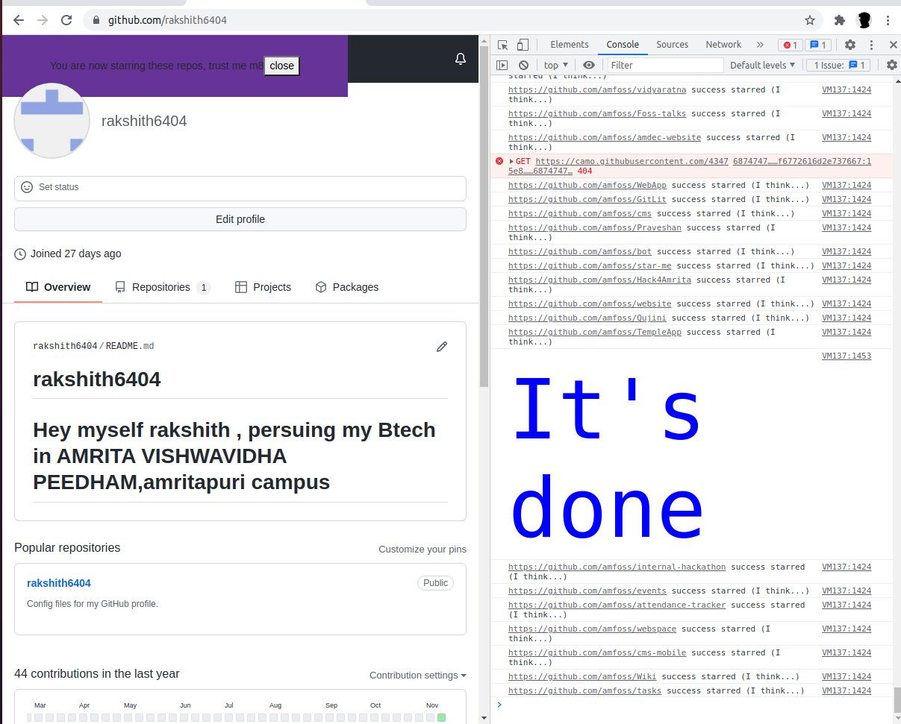

## Star all the [amFOSS](https://github.com/amfoss) repositories

#### This task was another one of the simplest task i would say personally.I refered to [link](https://github.com/amfoss/star-me) to star all the repos😃😃
### This Task is actually very intresting and also is a beginner task .Thank you for this one🙏.Staring all the repos of amfoss is amazing......
### Pasted the given code into the console , and there it is the **"It's done"**

### Have attached the [screen_shot](https://github.com/rakshith6404/amfoss-stage0/blob/main/task-01/AMFOSS_Its_done.png) below.

