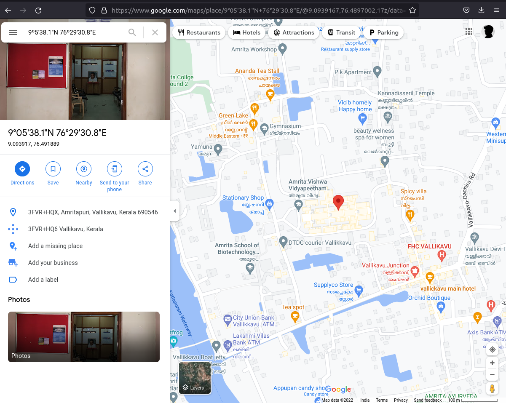

### Begin your journey with Linux and Git

### I found this task more intresting than the other 2 cause this task literally took my curiosity and anxiouness high above the sky as this is the first task which is to be done in ubuntu using terminal .
### Have uploadeded the [screenshots](https://github.com/rakshith6404/amfoss-stage0/blob/main/task-02/All_Steps.png) 1 by 1!!😊😊
### I have also added the [solutions](https://github.com/rakshith6404/amfoss-stage0/blob/main/task-02/Solution.md) that i have used to do this tasks and also the git commands used to push the tasks into my repository.

