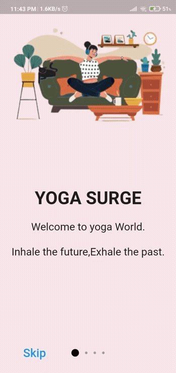

# Flutter based UI task

### Flutter based task was the most interesting and also a hectic one tbh cause i literally spent days on researches(tbh 3days) and also came across tons and tons of articles and also some of the Flutter Tutorials that i actually referred to. 

### After seeing people creating awesome applications in android i  was imagining how do these people make them...and thats when amFoss gave me a chance to create my own app.I literally took days to complete this task and also didnt lose hope cause last time i did this one , it was a big failure . But this time i didnt wanted to fail the same thing again so i literally didnt lose hope on this and started to do it with at most concentration.

## **My flutter App:**

</a>

> *I didnt know how to screen record in the android studio's SDK so i had to use my phone for that and also have showed skip button working.*

### Here are some of the references i made through 😃😃 : 
- [Flutter Docs](https://flutter.dev/docs)
- [Making the dot animated when changing tabs](https://pub.dev/packages/dots_indicator)
- [Introduction Screen Flutter Package](https://pub.dev/packages/introduction_screen)
- [Image assests](https://docs.flutter.dev/development/ui/assets-and-images)
- [Colors](https://api.flutter.dev/flutter/material/Colors-class.html)
- [Navigator](https://docs.flutter.dev/cookbook/navigation/navigation-basics)
- [DotsDecorator](https://pub.dev/packages/dotted_decoration)
- [Container](https://api.flutter.dev/flutter/widgets/Container-class.html)

