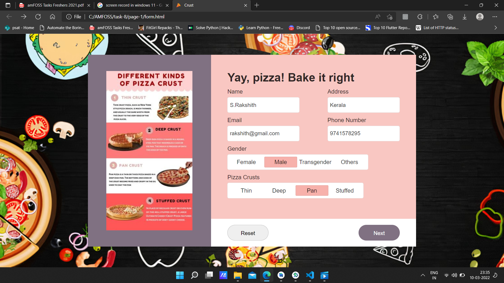

# JSExplorer

### This Task was an interesting one.....First of all i thought it would be hard but no , it wasnt that hard cause google is there to help me :cool...
### I have uploaded the final image of the pizza-crust and also have added a walkthrough of all pages and buttons working.
- [Page-1]()
- [Page-2]()
- [Page-3]()
- [Walkthrough]()

</a>

## Walkthrough 

</a>

> ##### forgot to add the page-2 in the walkthorugh....have added it [here]()